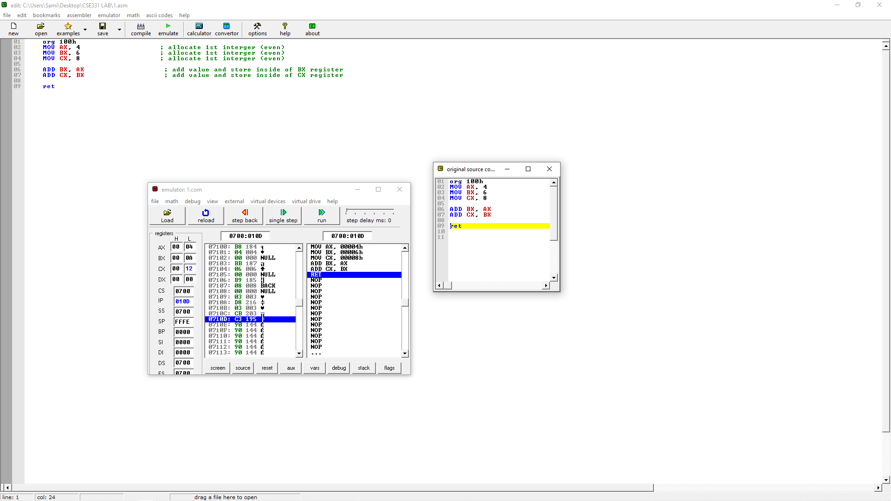
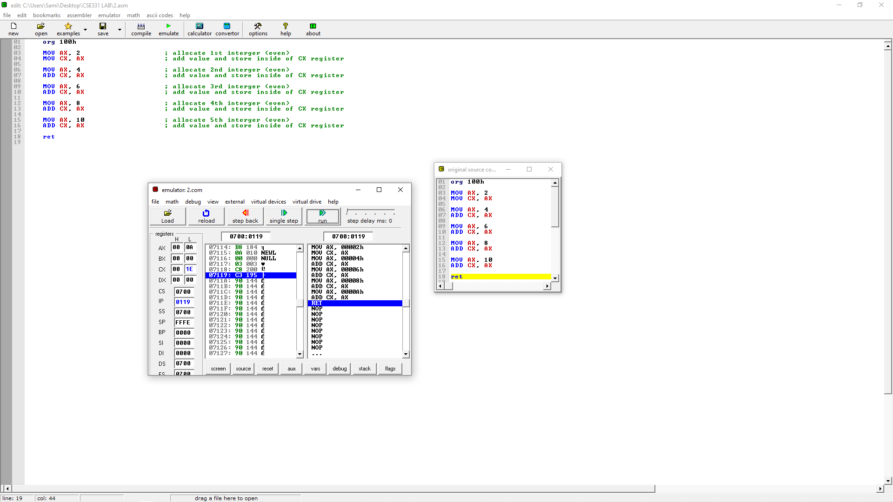

# HomeWork 1

Question:   1

> ADD 3 integers using <b>AX</b> register and store the result in <b>CX</b> register.

>

Question:   2

> Allocate first 5 even integers (starting from 2) in AX register and store their sum in CX register.

>
